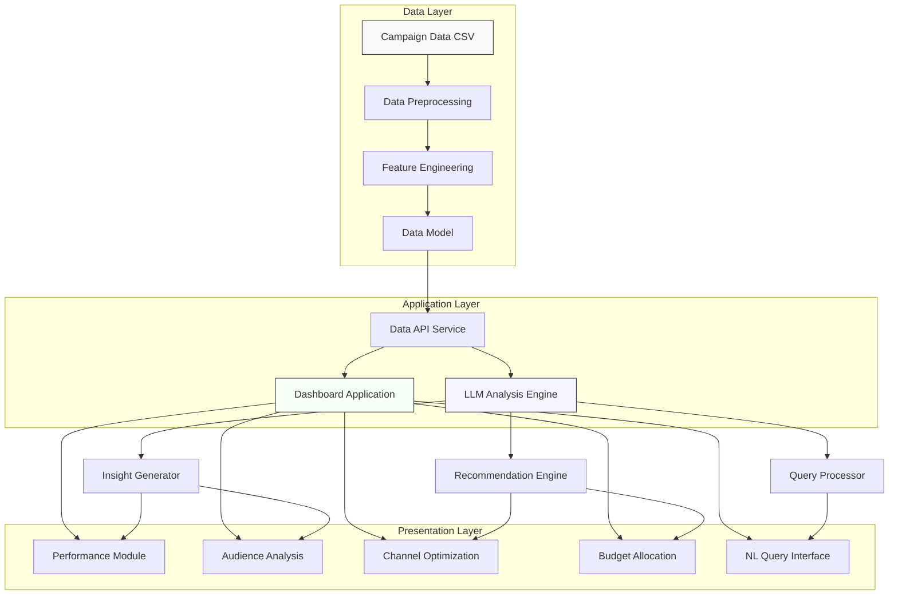

```mermaid
graph TD
    subgraph "Data Layer"
        A[Campaign Data CSV] --> B[Data Preprocessing]
        B --> C[Feature Engineering]
        C --> D[Data Model]
    end
    
    subgraph "Application Layer"
        D --> E[Data API Service]
        E --> F[Dashboard Application]
        E --> G[LLM Analysis Engine]
    end
    
    subgraph "Presentation Layer"
        F --> H[Performance Module]
        F --> I[Audience Analysis]
        F --> J[Channel Optimization]
        F --> K[Budget Allocation]
        F --> L[NL Query Interface]
    end
    
    G --> M[Insight Generator]
    G --> N[Recommendation Engine]
    G --> O[Query Processor]
    
    M --> H
    M --> I
    N --> J
    N --> K
    O --> L
    
    style A fill:#f9f9f9,stroke:#333,stroke-width:1px
    style G fill:#f5f5ff,stroke:#333,stroke-width:1px
    style F fill:#f5fff5,stroke:#333,stroke-width:1px
```